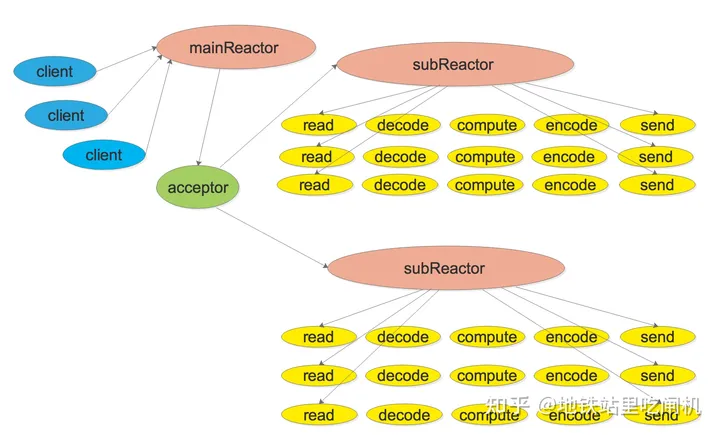

# Muduo的解析

## 1. Multi-Reactor 概述

Muduo库是基于Reactor模式实现的TCP网络编程库。该文章后续篇幅都是围绕Multi-reactor模型进行展开。Multi-Reactor模型如下所示（网上找的图，不是我画的）：


## 2. Multi-Reactor架构的三大核心模块介绍

### 2.1 概述

Muduo库有三个核心组件支撑一个reactor实现持续的监听一组fd,并根据每个fd发生的事件调用相应的处理函数。这三个组件分别是Channel类、Poller/Epoller类以及EventLoop类。EventLoop类包含了一个Channel和Poller

### 2.2 三大组件之一：Channel类

#### 2.2.1 Channel类概述

**Channel类相当于一个文件描述符的保姆**

在IO多路复用机制中，想用监听某个文件描述符，需要把这个fd和该fd感兴趣的事件通过epoll_ctl注册到epoll对象中。当事件监听器监听到该fd发生了某个事件。事件监听器返回[发生事件的fd集合]以及[每个fd都发生了什么事件]。

Channel类则封装了一个 [fd] 和这个 [fd感兴趣事件] 以及事件监听器监听到 [该fd实际发生的事件]。同时Channel类还提供了设置该fd的感兴趣事件，以及将该fd及其感兴趣事件注册到事件监听器或从事件监听器上移除，以及保存了该fd的每种事件对应的处理函数。

#### 2.2.2 Channel类重要的成员变量

- int fd_这个Channel对象照看的文件描述符
- int events_代表fd感兴趣的事件类型集合
- int revents_代表事件监听器实际监听到该fd发生的事件类型集合，当事件监听器监听到一个fd发生了什么事件，通过Channel::set_revents()函数来设置revents值。
- EventLoop* loop这个fd属于哪个EventLoop对象，这个暂时不解释。
- read_callback_、write_callback_、close_callback_、error_callback_：这些是std::function类型，代表着这个Channel为这个文件描述符保存的各事件类型发生时的处理函数。比如这个fd发生了可读事件，需要执行可读事件处理函数，这时候Channel类都替你保管好了这些可调用函数，真是贴心啊，要用执行的时候直接管保姆要就可以了

    ```cpp
    EventLoop *loop_; // 事件循环
    const int fd_;    // fd, poller 监听的文件描述符
    int events_;      // 注册fd感兴趣的事件,如EPOLLIN、EPOLLOUT事件
    int revents_;     // poller选择其返回具体发生的事件
    int index_;       //

    std::weak_ptr<void> tie_;
    bool tied_;

    // channel通道能够获知fd最终发生具体的事件revents,
    //所以它负责调用具体事件的回调函数
    ReadEventCallback readCallback_;
    EventCallback writeCallback_;
    EventCallback closeCallback_;
    EventCallback errorCallback_;
    ```

#### 2.2.3 Channel类重要的成员方法

- **向Channel对象注册各类事件的回调函数**

  ```cpp
    // 设置回调函数
    void setReadCallback(ReadEventCallback cb) { readCallback_ = std::move(cb); }
    void setWriteCallback(EventCallback cb) { writeCallback_ = std::move(cb); }
    void setCloseCallback(EventCallback cb) { closeCallback_ = std::move(cb); }
    void setErrorCallback(EventCallback cb) { errorCallback_ = std::move(cb); }
  ```

  一个文件描述符会发生可读、可写、关闭、错误事件。当发生这些事件后，就需要调用相应的处理函数来处理。外部通过调用上面这四个函数可以将事件处理函数放进Channel类中，当需要调用的时候就可以直接拿出来调用了。

- **设置文件描述符fd中感兴趣事件并注册到IO多路复用模块中**

  ```cpp
      //设置fd相应的事件状态
    void eableReading() { events_ |= KReadEvent; update(); }
    void disableReading() { events_ &= ~KReadEvent; update(); }
    void enableWriting() { events_ |= KWriteEvent; update(); }
    void disableWriting() { events_ &= ~KWriteEvent; update(); }
    void disableAll() { events_ = KNoneEvent; update(); }
    ```

    外部可以通过这些函数告知Channel你所监管的文件描述符都对那些事件类型感兴趣，并把这个文件描述符及其感兴趣的事件注册到事件监听器(epoll)。这里面的```update```函数其实本质上调用了```epoll_ctl()```。

- **暴露给Poller，用于Poll而设置在该Channel的文件描述符监听到的事件类型**
  
    ```cpp
    //供Poller使用，监听到事件触发时候创建Channel调用
    void set_revents(int revt) { revents_ = revt; }
    ```

- **处理事件的函数**

    ```cpp

    /**
     * @brief 根据poller通知的channel发生的具体事件，由channel调用具体的回调函数
     * 
     * @param receiveTime 接受时间戳
     */
    void Channel::handleEventWithGuard(Timestamp receiveTime)
    {
        LOG_INFO("channel handleEvent revents:%d", revents_);
        //如果触发关闭事件，调用关闭的回调函数
        if((revents_ & EPOLLHUP) && !(revents_ & EPOLLIN)) 
        {
            if(closeCallback_) {
                closeCallback_();
            }
        }
        //如果触发错误事件，调用错误的回调函数
        if(revents_ & EPOLLERR)
        {
            if(errorCallback_) {
                errorCallback_();
            }
        }
        //如果触发可读事件，调用可读的回调函数
        if(revents_ & (EPOLLIN | EPOLLPRI))
        {
            if(readCallback_) {
                readCallback_(receiveTime);
            }
        }
        //如果触发发送事件，调用发送的回调函数
        if(revents_ & EPOLLOUT)
        {
            if(writeCallback_)
            {
                writeCallback_();
            }
        }
    }
    ```

    当调用```epoll_wait()```后，可以得知事件监听器上哪些Channel（文件描述符）发生了哪些事件，事件发生后自然就要调用这些Channel对应的处理函数。 ```Channel::HandleEvent```，让每个发生了事件的Channel调用自己保管的事件处理函数。每个Channel会根据自己文件描述符实际发生的事件（通过Channel中的revents_变量得知）和感兴趣的事件（通过Channel中的events_变量得知）来选择调用read_callback_和/或write_callback_和/或close_callback_和/或error_callback_。

### 2.3 三大核心模块之一：Poller/Epoller

#### 2.3.1 Poller和EpollPoller概述

Poller负责监听文件描述符事件是否触发以及返回发生事件的文件描述符以及具体事件。
Muduo实现了Poll和Epoll两种IO多路复用模型来进行事件监听。默认是使用epoll来实现，也可选择poll。```Poller```是实现poll和epoll的抽象虚类，与监听文件描述符和返回监听结果的具体方法也基本上是在这两个派生类中实现。```EpollPoller```就是封装了用epoll方法实现的与事件监听有关的各种方法，```PollPoller```就是封装了poll方法实现的与事件监听有关的各种方法.